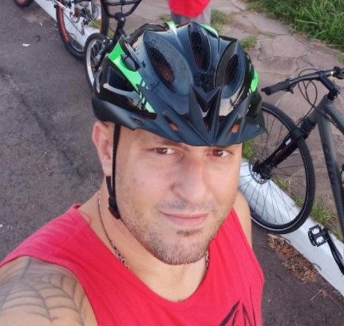
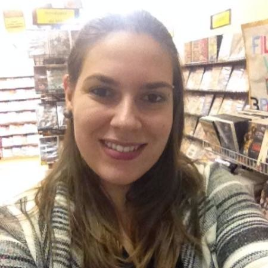

# Desafio Git e GitHub

Esse é seu primeiro desafio na Meentoria, estamos fazendo-o para que você possa por em prática e por em teste os conhecimentos que você adquiriu durante a aula de Git & GitHub na live do [@DanielHe4rt](https://github.com/DanielHe4rt). Caso tenha dúvidas sobre como proceder em algum momento recomendamos que você:

- Reveja a aula;
- [Consulte o Git4Noobs](https://github.com/DanielHe4rt/git4noobs);
- Se e somente não encontrar o que está procurando e/ou ainda estiver com dificuldade pergunte a sua dúvida no Grupo do Whatsapp.

**Prazo**: 23/09/2021 às 18:00 ¹ 

¹ até dia 30/09/2021 para a Alessandra e Adriel que teve problemas com o equipamento.

## Problema

Queremos criar uma lista dos alunos que estão participando do Meentoria, nessa lista vai conter o nome, foto de perfil, idade, cidade, link para a conta no GitHub e um pequeno texto do que o meentorando espera para os seus próximos dez anos de carreira / qual seu(s) sonhos. 

Cada um de vocês vai ter que se adicionar na lista. Para fazer isso vai ser necessário que vocês façam uma Pull Request se adicionando na lista:

- Façam um fork desse repositório. (1 pontos)
- Clonem o seu fork na sua máquina.
- Fazer uma branch com seu nome. (2 ponto)
- Façam as alterações necessárias para ter seu perfil na lista. (2 pontos)
  - E para isso você deve usar Markdown como no template (1 ponto)
- Enviem a alteração para Pull Request / Abram a PR no GitHub da sua Branch para a Main desse repo. (2 pontos)

Além disso vocês também devem:
- Fazer uma revisão simbólica (dar um oi, fazer um comentário) no PR de um colega. (1 ponto)
- Seguir o perfil dos mentores e dos outros mentorandos (0,1 pontos por perfil seguido)

Para se adicionar a lista basta copiar e colar o template abaixo colocando as suas informações:

```
#### Seu nome


**Idade**: XX anos ||
**Cidade**: Sua Cidade ||
**Link Github**: [Link](link do seu perfil)

#### O que eu espero para meu futuro:
bla bla bla

---
```

## Lista de Mentorandos

#### Camilo Cunha de Azevedo


**Idade**: 26 anos ||
**Cidade**: Bento Gonçalves ||
**Link Github**: [Link](https://github.com/Camilotk)

#### O que eu espero para meu futuro:
Eu tenho aprendido muito com as mentorias do Meetanços e tem sido muito bom ver como as pessoas que participam do programa estão se desenvolvendo e vendo seus sonhos acontecer. Para meu futuro eu espero conseguir entrar na Área de Pesquisa Acadêmica em Visão Computacional e IA e conseguir futuramente dar aulas de Programação em Universidades.

---

#### Gustavo Schneider


**Idade**: 22 anos ||
**Cidade**: Bento Gonçalves ||
**Link Github**: [Link](https://github.com/SttavoS)

#### O que eu espero para meu futuro:
Eu espero ser um desenvolvedor/engenheiro de software competente. Mas para isso eu vejo que ainda tenho um longo caminho a trilhar, quero aprender muitas coisas para poder escrever um código de qualidade, me aprofundar em algoritmos, padrões de projeto, testes automatizados, arquitetura de software, etc. Também quero contribuir para o Open Source de alguma forma, e ajudar da outras pessoas da forma que estou sendo ajudado nesta mentoria.

---

#### Matheus Nunes Sena


**Idade**: 23 anos ||
**Cidade**: Cachoeirinha ||
**Link Github**: [Link](https://github.com/msena98)

#### O que eu espero para meu futuro:
Atualmente tenho me empenhado bastante em me tornar futuramente um grande desenvolvedor, desde os princípios básicos até os mais avançados, estou tendo o imenso apoio do projeto de Meentoria do Meetanços. Espero para meu futuro que eu me desenvolva cada vez mais, espero também participar de projetos que impactem a vida das pessoas, fazendo com que a tecnologia traga mais qualidade para vida das pessoas.

---

#### Guilherme Farina Ojeda


**Idade**: 37 anos ||
**Cidade**: Canoas ||
**Link Github**: [Link](https://github.com/bahterista)

#### O que eu espero para meu futuro:
Meu intuito é de atingir um nível de excelência nas habilidades que estamos desenvolvendo no curso. Em dez anos pretendo estar bem colocado no mercado de trabalho de TI, sempre adquirindo e repassando conhecimento, em aperfeiçoamento constante.

---

#### Fernanda Bottega Tomasini


**Idade**: 33 anos ||
**Cidade**: Bento Gonçalves ||
**Link Github**: [Link](https://github.com/FerTomasini)

#### O que eu espero para meu futuro:
Espero no futuro ser uma desenvolvedora de sucesso ou algo próximo! É um longo caminho e muitos desafios a serem vencidos, mas seguimos na luta! Objetivo: ao exterior e além! ✈

---